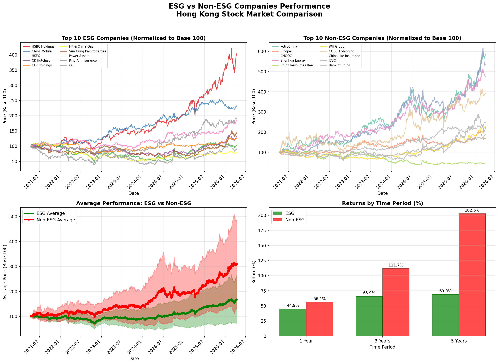

# ESG vs Non-ESG Performance Analysis - Hong Kong Stock Market

This visualization compares the stock performance of the top 10 ESG-scored companies versus the top 10 non-ESG companies in the Hong Kong Stock Market over 1, 3, and 5 year periods.

## Performance Comparison (5 Years)



## Key Findings

| Period | ESG Avg Return | Non-ESG Avg Return | Difference |
|--------|---------------|-------------------|------------|
| 1 Year | 44.92% | 56.07% | -11.15% |
| 3 Years | 65.94% | 111.67% | -45.72% |
| 5 Years | 68.99% | 202.60% | -133.61% |

## Companies Analyzed

### Top 10 ESG Companies
1. HSBC Holdings (0005.HK)
2. China Mobile (0941.HK)
3. HKEX (0388.HK)
4. CK Hutchison (0001.HK)
5. CLP Holdings (0002.HK)
6. HK & China Gas (0003.HK)
7. Sun Hung Kai Properties (0016.HK)
8. Power Assets (0006.HK)
9. Ping An Insurance (2318.HK)
10. CCB (0939.HK)

### Top 10 Non-ESG Companies
1. PetroChina (0857.HK)
2. Sinopec (0386.HK)
3. CNOOC (0883.HK)
4. Shenhua Energy (1088.HK)
5. China Resources Beer (0291.HK)
6. WH Group (0288.HK)
7. COSCO Shipping (1919.HK)
8. China Life Insurance (2628.HK)
9. ICBC (1398.HK)
10. Bank of China (3988.HK)

## Methodology

- **Data Source**: Yahoo Finance
- **Time Periods**: 1 year, 3 years, and 5 years
- **Normalization**: All prices normalized to base 100 for comparison
- **Performance Metric**: Total return percentage

## How to Reproduce

Run the Python script to generate updated visualizations:

```bash
python3 esg_performance_visualization.py
```

## Disclaimer

This analysis is for informational purposes only and should not be considered as investment advice. Past performance does not guarantee future results.
